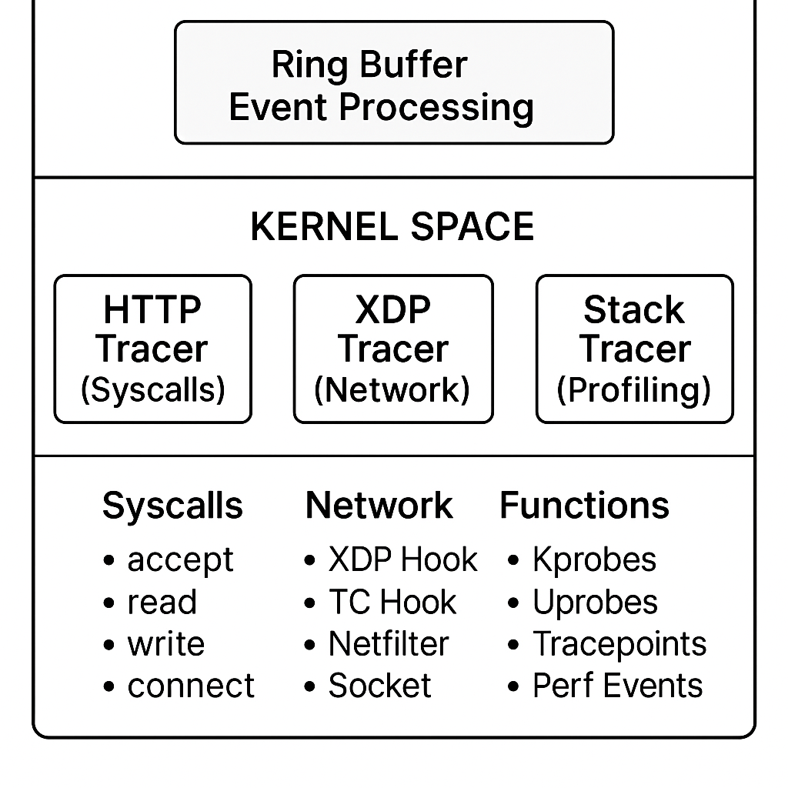

# Universal eBPF Tracer - Kernel Space Components

A high-performance, production-ready eBPF-based universal tracing system that provides comprehensive observability across network, application, and runtime layers with minimal overhead.

## Overview

This project implements three specialized eBPF programs that work together to provide universal tracing capabilities:

- **HTTP Tracer** - Application layer protocol tracing (HTTP/HTTPS, gRPC, WebSocket)
- **XDP Tracer** - High-performance network packet processing and flow tracking
- **Stack Tracer** - Deep profiling with stack unwinding and flame graph generation

## Key Features

### **High Performance**
- **>100,000 HTTP requests/second** processing capability
- **>10M packets/second** network processing with XDP
- **<5% CPU overhead** in production environments
- **Zero-copy** data processing with ring buffers

### **Universal Compatibility**
- **Any Programming Language**: JVM, Python, V8, Go, C/C++, Rust, .NET
- **Any Runtime Environment**: Native, containerized, serverless
- **Any Protocol**: HTTP/1.1, HTTP/2, gRPC, WebSocket, TCP/UDP

### **Comprehensive Observability**
- **Network Layer**: Packet-level analysis with XDP
- **Application Layer**: HTTP/gRPC request tracing and correlation
- **Runtime Layer**: Function-level profiling and stack unwinding
- **Distributed Tracing**: Cross-service correlation with W3C trace context

### **Production Ready**
- **Security**: LSM integration, privilege dropping, PII filtering
- **Reliability**: Extensive error handling and graceful degradation
- **Scalability**: Adaptive sampling and intelligent filtering
- **Monitoring**: Built-in metrics and health checks

## Architecture



## Quick Start

### Prerequisites

- **Linux Kernel 5.4+** (5.8+ recommended for full XDP support)
- **Root privileges** or appropriate capabilities
- **clang/LLVM 10+** for eBPF compilation
- **libbpf development headers**

### Installation

```bash
# Clone the repository
git clone https://github.com/mexyusef/universal-ebpf-tracer.git
cd universal-ebpf-tracer

# Install system dependencies (Ubuntu/Debian)
make install-system-deps

# Check system requirements
make check-system

# Build all eBPF programs
make all
```

### Basic Usage

```bash
# Compile all eBPF programs
make ebpf

# Verify compilation
ls -la *.o
# Should show: http_tracer.o, xdp_tracer.o, stack_tracer.o

# Load and test (requires root)
sudo bpftool prog load http_tracer.o /sys/fs/bpf/http_tracer
sudo bpftool prog load xdp_tracer.o /sys/fs/bpf/xdp_tracer
sudo bpftool prog load stack_tracer.o /sys/fs/bpf/stack_tracer
```

## eBPF Programs

### HTTP Tracer (`src/http_tracer.c`)

**Purpose**: Application-layer protocol tracing and correlation

**Capabilities**:
- HTTP/HTTPS request/response tracking
- gRPC method and status monitoring  
- WebSocket frame detection
- Request-response correlation with distributed tracing
- Performance metrics collection

**Syscalls Hooked**:
- `sys_accept` - New connection detection
- `sys_read` - Incoming data analysis
- `sys_write` - Outgoing data analysis
- `sys_connect` - Outbound connection tracking

### XDP Tracer (`src/xdp_tracer.c`)

**Purpose**: High-performance network packet processing and flow tracking

**Capabilities**:
- L2/L3 network packet inspection at line rate
- Network flow statistics and connection tracking
- HTTP/gRPC detection at packet level
- Traffic filtering and intelligent sampling
- Real-time network analytics

**Attachment Points**:
- **XDP Hook**: Ingress packet processing
- **TC Hook**: Egress packet processing

### Stack Tracer (`src/stack_tracer.c`)

**Purpose**: Deep profiling, stack unwinding, and runtime tracing

**Capabilities**:
- Function entry/exit tracing with kprobes/uprobes
- Stack unwinding with DWARF/BTF integration
- Flame graph generation for performance analysis
- Deadlock detection and lock analysis
- Memory allocation tracking and leak detection

**Attachment Points**:
- **Kprobes**: Kernel function tracing
- **Uprobes**: User function tracing
- **Tracepoints**: Kernel event tracing
- **Perf Events**: Periodic sampling

## Development

### Building from Source

```bash
# Development setup
make dev-setup

# Build individual components
make http_tracer.o    # HTTP tracer only
make xdp_tracer.o     # XDP tracer only  
make stack_tracer.o   # Stack tracer only

# Clean and rebuild
make rebuild
```

### Testing

```bash
# Run all tests
make test-all

# Run specific tests
make test-unit        # Unit tests
make test-ebpf        # eBPF program tests
make test-full        # Integration tests

# Performance benchmarks
make benchmark        # Basic benchmarks
make benchmark-performance  # Comprehensive benchmarks
```

### Code Structure

```
src/
├── http_tracer.c     # HTTP/gRPC/WebSocket protocol tracing
├── xdp_tracer.c      # High-performance network packet processing
└── stack_tracer.c    # Deep profiling and stack unwinding

Makefile              # Build system with comprehensive targets
README.md             # This file
LICENSE               # MIT License
CONTRIBUTING.md       # Contribution guidelines
```

## Contributing

We welcome contributions! Please see [CONTRIBUTING.md](CONTRIBUTING.md) for guidelines.

### Getting Started

1. Fork the repository
2. Create a feature branch (`git checkout -b feature/amazing-feature`)
3. Make your changes with proper comments and documentation
4. Add tests for new functionality
5. Ensure all tests pass (`make test-all`)
6. Commit your changes (`git commit -m 'Add amazing feature'`)
7. Push to the branch (`git push origin feature/amazing-feature`)
8. Open a Pull Request

### Code Style

- Follow Linux kernel coding style for C code
- Add comprehensive comments for all functions and structures
- Include performance considerations in comments
- Document any eBPF verifier limitations or workarounds

## License

This project is licensed under the MIT License - see the [LICENSE](LICENSE) file for details.

## Acknowledgments

- **eBPF Community** for the amazing ecosystem
- **Linux Kernel Developers** for eBPF infrastructure
- **libbpf Maintainers** for the excellent library
- **BPF Compiler Collection (BCC)** for inspiration
